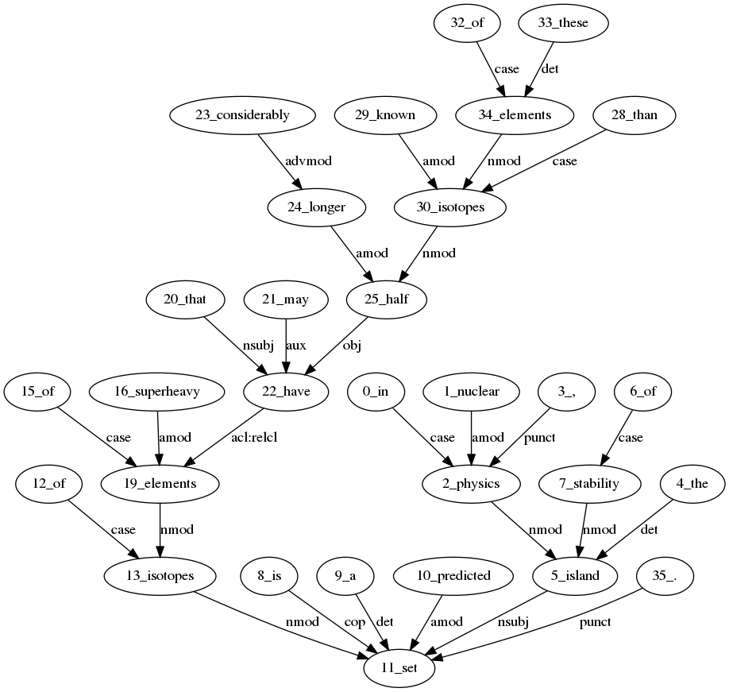
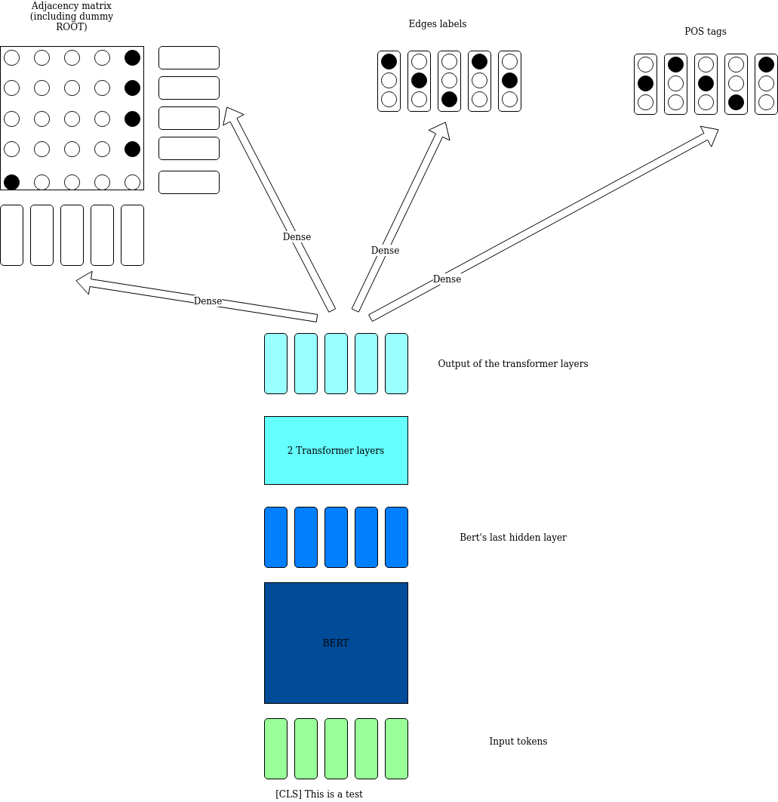

# Simple Dependency Parser

This repo contains a simple code on a BERT-based dependency parse. 
I wanted to build one from scratch and ended up being surprised by how easy 
it has become at the current level of NLP.

The main inspiration is [Dozat and Manning] as well as [Kondratyuk and Straka].

## Installation
Please install [git-lfs](https://git-lfs.github.com/) before installing

```bash
git clone https://github.com/fractalego/tree_parser.git
cd tree_parser
virtualenv .env --python=/usr/bin/python3
pip install .
```

# Example

An example code is as below (in the file [predict.py](tree_parser/predict.py))

```python
import os

from networkx.drawing.nx_agraph import write_dot

from tree_parser.parser import DependencyParser

_path = os.path.dirname(__file__)

_save_filename = os.path.join(_path, '../data/tree_parser.model')

_text = """
In nuclear physics, the island of stability is a predicted set of isotopes of superheavy elements 
that may have considerably longer half-lives than known isotopes of these elements. 
"""

if __name__ == '__main__':
    parser = DependencyParser(_save_filename)
    g = parser.parse(_text)

    write_dot(g, 'test.dot')

```

Which parses the sentence 

``
In nuclear physics, the island of stability is a predicted set of isotopes of superheavy elements 
that may have considerably longer half-lives than known isotopes of these elements. 
``

And outputs a '.dot' file.

The file can be converted onto a png using graphviz

```bash
dot -Tpng test.dot -o foo.png
```


## Features

The output of `DependencyParser().parse()` is a Networkx graph.
Each node has two attributes:
 
1) 'pos', the POS tag 
2) 'token', the parsed word.

Each edge has only one attribute 'label'. 
They can be accessed through the 

In addition the ID associated to each node is of the form `<INDEX>_TOKEN`

In the previous example the code

```python
    import networkx as nx

    print('Node words:')
    print(nx.get_node_attributes(g, 'token'))
    print('Node POS tags:')
    print(nx.get_node_attributes(g, 'pos'))
    print('edge labels:')
    print(nx.get_edge_attributes(g, 'label'))
```

would output

```python
Node words:
{'0_in': 'in', '2_physics': 'physics', '1_nuclear': 'nuclear', '5_island': 'island', '3_,': ',', '4_the': 'the', '11_set': 'set', '6_of': 'of', '7_stability': 'stability', '8_is': 'is', '9_a': 'a', '10_predicted': 'predicted', '12_of': 'of', '13_isotopes': 'isotopes', '15_of': 'of', '19_elements': 'elements', '16_superheavy': 'superheavy', '20_that': 'that', '22_have': 'have', '21_may': 'may', '23_considerably': 'considerably', '24_longer': 'longer', '25_half': 'half', '28_than': 'than', '30_isotopes': 'isotopes', '29_known': 'known', '32_of': 'of', '34_elements': 'elements', '33_these': 'these', '35_.': '.'}
Node POS tags:
{'0_in': 'IN', '2_physics': 'NN', '1_nuclear': 'JJ', '5_island': 'NNP', '3_,': ',', '4_the': 'DT', '11_set': 'NN', '6_of': 'IN', '7_stability': 'NN', '8_is': 'VBZ', '9_a': 'DT', '10_predicted': 'VBN', '12_of': 'IN', '13_isotopes': 'NNS', '15_of': 'IN', '19_elements': 'NNS', '16_superheavy': 'JJ', '20_that': 'WDT', '22_have': 'VB', '21_may': 'MD', '23_considerably': 'RB', '24_longer': 'JJR', '25_half': 'NNS', '28_than': 'IN', '30_isotopes': 'NNS', '29_known': 'VBN', '32_of': 'IN', '34_elements': 'NNS', '33_these': 'DT', '35_.': '.'}
edge labels:
{('0_in', '2_physics'): 'case', ('2_physics', '5_island'): 'nmod', ('1_nuclear', '2_physics'): 'amod', ('5_island', '11_set'): 'nsubj', ('3_,', '2_physics'): 'punct', ('4_the', '5_island'): 'det', ('6_of', '7_stability'): 'case', ('7_stability', '5_island'): 'nmod', ('8_is', '11_set'): 'cop', ('9_a', '11_set'): 'det', ('10_predicted', '11_set'): 'amod', ('12_of', '13_isotopes'): 'case', ('13_isotopes', '11_set'): 'nmod', ('15_of', '19_elements'): 'case', ('19_elements', '13_isotopes'): 'nmod', ('16_superheavy', '19_elements'): 'amod', ('20_that', '22_have'): 'nsubj', ('22_have', '19_elements'): 'acl:relcl', ('21_may', '22_have'): 'aux', ('23_considerably', '24_longer'): 'advmod', ('24_longer', '25_half'): 'amod', ('25_half', '22_have'): 'obj', ('28_than', '30_isotopes'): 'case', ('30_isotopes', '22_have'): 'nmod', ('29_known', '30_isotopes'): 'amod', ('32_of', '34_elements'): 'case', ('34_elements', '30_isotopes'): 'nmod', ('33_these', '34_elements'): 'det', ('35_.', '11_set'): 'punct'}

```

## Architecture and training

The stylized architecture is depicted below 



While the full code is found in the file [model.py](tree_parser/model.py) 

The system is trained with an Adam optimizer using 5e-5 as step size. 

The two transformer layers seem to add stability to training: without the the system ends up stuck in a local minimum after a few epochs.


## Dataset and results

The system is trained on the UG dataset [en_gum-ud](https://universaldependencies.org/treebanks/en_gum/index.html)

The results of the system are quite good. A comparison with a non BERT-based method can be found in the excellent paper   [Nguyen and Vespoor](https://www.aclweb.org/anthology/K18-2008/):
Bert seems to add 6% points in UAS and 7 in LAS. 
Curiously the POS score is increased by only 1 percentage point.   

| Set | UAS | LAS | POS |
|:---:|:---:|:---:|:---:|
| Dev | 0.91| 0.88| 0.96|
| Test| 0.9 | 0.87| 0.95|


# Comments 

A pretrained BERT language model seems to be improving upon LSTM based training. By quite a lot!  